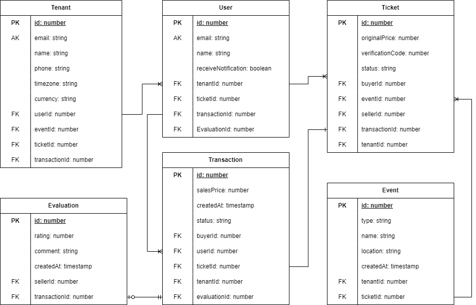

# Construção de Software

-  Professor: Miguel Xavier
-  Código: 46504-04
-  Semestre: 2024/2
-  Nota: 9.0

<h2>Table of Contents</h2>

- [Description](#description)
  - [Entities](#entities)
    - [Database Diagram](#database-diagram)
    - [Tenant](#tenant)
    - [User](#user)
    - [Event](#event)
    - [Ticket](#ticket)
    - [Transaction](#transaction)
    - [Evaluation](#evaluation)
- [Technical Specifications](#technical-specifications)
  - [More About Docker](#more-about-docker)
  - [More About Terraform](#more-about-terraform)
  - [More About AWS CLI](#more-about-aws-cli)
  - [More About SAM](#more-about-sam)
  - [Terraform and SAM?](#terraform-and-sam)
- [How to Run](#how-to-run)
  - [How to Deploy](#how-to-deploy)
    - [AWS Credentials](#aws-credentials)
    - [Terraform Variables](#terraform-variables)
- [Cheat Sheet](#cheat-sheet)
  - [Docker Actions](#docker-actions)
  - [Terraform Actions](#terraform-actions)
  - [AWS CLI Actions](#aws-cli-actions)
  - [SAM Actions](#sam-actions)
  - [Run Tests](#run-tests)
  - [Custom Actions](#custom-actions)
- [Authors](#authors)

## Description

This project is a simple API that describes an event-oriented ticketing system. It is a simple application that allows users to create events and tickets for those events, as well as buy tickets for events created by other users, provide feedback on the sellers, and view the feedback provided by other users, among other features.

For more specific business rules and project description, please refer to the [full document](./docs/UseCases.md).

### Entities

Let's talk about the main entities of the application:

#### Database Diagram



#### Tenant

The tenant represents a logical grouping of users, events, tickets and transactions. It is used to separate the data of different users, so that each user can only see and interact with their own data. There are three types of tenants: `Admin`, `Seller` and `Buyer`.

#### User

The user is one of the central components of the application, it is intrinsically linked to the tenant, as it must always be associated with one. This entity represents the users of the application, who can be `Administrators`, `Sellers` or `Buyers`. The user can create events, tickets and transactions, as well as provide feedback on other users, depending on their role.

#### Event

The event is an entity that represents a gathering of people for a specific purpose. It is created by an administrator (tenant) and can have a title, description, location and a list of tickets associated with it. The event can be public or private, and only the users who have the event's access code can buy tickets for it.

#### Ticket

The ticket is an entity that represents the right to attend an event. It is created by a seller (tenant) and has a price, a verification code and a status. The ticket can be bought by a buyer (tenant) and can be used to attend the event. The ticket can be in one of the following statuses: `Available`, `Sold`, `Used` or `Refunded`.

#### Transaction

The transaction is an entity that represents the purchase of a ticket by a buyer. It is created by the buyer and has a status, a timestamp and a reference to the ticket that was bought. The transaction can be in one of the following statuses: `Pending`, `Completed` or `Refunded`. The transaction is used to verify the validity of the ticket and to provide feedback on the seller.

#### Evaluation

The evaluation is an entity that represents the feedback provided by a user about another user. It is created by the buyer and has a rating and a comment. The evaluation is used to provide feedback on the seller and can be used to help other buyers make informed decisions.

## Technical Specifications

This project was developed using [NestJS](https://nestjs.com/) with [TypeScript](https://www.typescriptlang.org/) and uses a PostgreSQL database managed by [TypeORM](https://typeorm.io/) to store the data. It is deployed on [AWS](#aws-cli) using [Docker](#docker) containers and [Terraform](#terraform) to create the necessary resources as well as [SAM]() for the serverless application.

### More About [Docker](https://www.docker.com/)

Docker is used to create containers for the application and the database. It is used to create a development environment that is as close as possible to the production environment.
It is highly recommended to use Docker to run the application.
We are also using [Docker Hub](https://hub.docker.com/) to store the application image.

We have a [`Dockerfile`](Dockerfile) that contains the configuration for the application container and two `docker-compose` files, one for [development](docker-compose.yml) and one for [production](docker-compose.prod.yml).

For some useful Docker commands, [click here](#docker-actions).

### More About [Terraform](https://www.terraform.io/)

Terraform is used to create the infrastructure on AWS. It creates the necessary resources for the application to run on the cloud.
We are using Terraform to create a simple ec2 instance with a security group and a key pair, which can be used to login into the instance.

We have a `main.tf` file that contains the configuration for the resources that will be created on AWS.

For some useful Terraform commands, [click here](#terraform-actions).

### More About [AWS CLI](https://aws.amazon.com/cli/)

The AWS CLI is used to interact with AWS services, it can be used for finer control over the resources created by Terraform, altough it is not necessary. It is being used to upload the `docker-compose` file to the s3 bucket.

### More About [SAM](https://aws.amazon.com/serverless/sam/)

The AWS Serverless Application Model (SAM) is used to deploy the application as a serverless application on AWS. It creates the necessary resources for the application to run on the cloud and is being used to deploy two lambda functions that will be invoked by an API Gateway.

### Terraform and SAM?

Why are we using both Terraform and SAM? The answer is simple: Terraform is used to create the infrastructure on AWS, while SAM is used to deploy the application as a serverless application on AWS. They are used together to create a complete environment for the application to run on the cloud either as a server or as a serverless application.

## How to Run

Now that you have all the necessary tools installed, you can run the application.
To start the application with Docker, simply run the following command:

```bash
$ docker compose up --build
```

That's it! The application should be running on http://localhost:8000.

You can access the API documentation built with [Swagger](https://swagger.io/) on http://localhost:8000/docs.

Now, assuming that you have made changes to the application and want to publish them to the cloud, here's a step-by-step guide on how to do it:

### How to Deploy

#### AWS Credentials

Before exporting the application, you should have your updated AWS credentials in the default directory for your system following the content in the [`credentials.template`](.aws/credentials.template) file. This is only necessary if you want to deploy the application on AWS (using terraform and SAM), for local development you can ignore this step.
In order to setup the environment variables you need to have the [AWS CLI](https://aws.amazon.com/cli/) installed and configured. You can setup your credentials by running the following command:

```bash
$ aws configure
# AWS Access Key ID [None]: YOUR_ACCESS_KEY
# AWS Secret Access Key [None]: YOUR_SECRET_KEY
# Default region name [us-east-1]: YOUR_REGION
# Default output format [json]: YOUR_OUTPUT_FORMAT
```

If you have a `AWS_SESSION_TOKEN`, you will have to manually update the `credentials` file with the necessary information.
On the terminal, you can run the following command to add this field:

```bash
# Linux
$ echo "aws_session_token = YOUR_SESSION_TOKEN" >> ~/.aws/credentials

# Windows (CMD)
$ echo aws_session_token = YOUR_SESSION_TOKEN >> %UserProfile%\.aws\credentials

# Windows (Powershell)
$ Add-Content -Path $env:UserProfile\.aws\credentials -Value "aws_session_token = YOUR_SESSION_TOKEN"
```

To verify if the credentials are correctly set, you can run the following command:

```bash
# Check the credentials
$ aws sts get-caller-identity
```

#### Terraform Variables

After setting up the AWS credentials, you should have the necessary values to run the Terraform script.
Inside the `infra` directory, you will find a `aws.auto.tfvars.example` file, which contains the necessary variables for the Terraform script. You could copy this file and rename it to `aws.auto.tfvars`, then fill in the necessary information, or simply run the following command:

```bash
$ scripts/set-aws-tfvars.sh
```

Sometimes, we might also need these values as environment variables. In which case you can set them with the following command:

```bash
$ scripts/set-aws-env-variables.sh
```

To verify if the environment variables are correctly set, you can run the following commands:

```bash
# Change "TOKEN" to the name of the environment variable you want to check
# Available variables: AWS_PROFILE, AWS_ACCESS_KEY_ID, AWS_SECRET_ACCESS_KEY, AWS_SESSION_TOKEN

# Check the environment variables (Linux)
$ echo $TOKEN

# Check the environment variables (Windows - CMD)
$ echo %TOKEN%

# Check the environment variables (Windows - Powershell)
$ echo $env:TOKEN
```

For the variables, you can simply check if the [`aws.auto.tfvars`](infra/aws.auto.tfvars) file is present and properly filled.

In order to deploy the application, you should upload these variables to the HashiCorp Vault. You can do this by accessing the [Vault UI](https://app.terraform.io/app/YOUR_ORG/workspaces/YOUR-ORG-workspace/variables) and adding the necessary variables.

Remember to also set these credentials on [GitHub](https://github.com/YOUR-ORG/YOUR_REPO/settings/secrets/actions) to allow the deployment to run smoothly.

Now you can proceed with the deployment:

1. Update the application image on Docker Hub:

For this step you should have a Docker Hub account and be logged in on the terminal, which can be done with the following command:

```bash
$ docker login
```

Remember to change the image name and tag variables in the [`update-image-dockerhub.sh`](scripts/update-image.sh) and [`update-image-ecr.sh`] scripts to your own image name and tag.
This is the most important step, you must update the image on Docker Hub / ECR so that the instance can download it and run the application with the latest changes.

```bash
$ scripts/update-image-dockerhub.sh
```

```bash
$ scripts/update-image-ecr.sh
```

1. (Optional) Update the `docker-compose` file on the s3 bucket:

Remember to change the bucket name variable in the [`upload-compose.sh`](scripts/upload-compose.sh) script to your own bucket name.
Run this only if you have made changes to the `docker-compose.prod.yml` file and want to update the one on the s3 bucket.
Altough we are using a public bucket, if you update the file you must manually update the Access control list (ACL) file on the bucket to allow `Read` access to the `Object` for `Everyone (public access)`. This is necessary because the instance will download the file from the bucket.

```bash
$ scripts/upload-compose.sh
```

3. Infrastructure as Code (IaC) with Terraform and SAM:

First move to the `infra` directory:

```bash
$ cd infra
``` 

4. Initialize the Terraform environment:

This command will download the necessary plugins to run the Terraform script, you should only need to run this once.

```bash
$ terraform init
```

5. Push the changes to the cloud:

Since we are using a HashiCorp Vault to store the sensitive information, you should have the necessary permissions to access it. You can use the following command to login into the vault:

```bash
$ terraform login
```

Then update the [terraform (`.tf`) files](infra) with the necessary information, such as the [image name and tag](infra/ec2.tf), the bucket name and your [organization details](infra/backend.tf).

This command will show you what will be created on AWS, you can review it and then confirm the changes.

```bash
$ terraform apply
```

(Optional) 
Access your instance (under the EC2 tab) on the AWS console to get the public IP address and access the application.

To enter into the instance move back to the root directory and run the following command:

```bash
# Linux
$ ./scripts/access-instance.sh

# Windows (Powershell)
$ .\scripts\access-instance.ps1
```

Known issues with PowerShell:

- If you get an error message saying that running scripts is disabled on your system, you can run the following command to enable it for the current session:

```bash
$ Set-ExecutionPolicy -ExecutionPolicy Bypass -Scope Process
```

- If you get an error saying permission is denied, open the file with file explorer, right click the my-key.pem file, go to properties, security, edit, and check that your user has at least read & execute permissions.

1. Build the application (SAM):

This command will build the application using SAM, you should only need to run this once. Sometimes it throws a huge error, then you should run it again.

```bash
$ sam build -m ../package.json
```

7. Deploy the application (SAM):

This command will deploy the application on AWS using SAM, you will be asked to provide some information about the deployment.

```bash
$ sam deploy --guided
```

That's it! The serverless application should be running on AWS.

## Cheat Sheet

### Docker Actions

```bash
# Build the containers
$ docker compose up --build

# List all containers
$ docker ps

# Access the container
$ docker exect -it {{container_id}} sh
```

### Terraform Actions

```bash
# Initialize terraform environment
$ terraform init

# See what will be setup
$ terraform plan

# Push changes to cloud
$ terraform apply

# "Rollback" Changes
$ terraform destroy
```

### AWS CLI Actions

```bash
# Configure the AWS CLI
$ aws configure
```

```bash
# Verify the credentials
$ aws sts get-caller-identity
```

### SAM Actions

```bash
# Build the application
$ sam build

# Deploy the application
$ sam deploy --guided

# Remove the application
$ sam delete --stack-name {{stack_name}}
```

### Run Tests

Can be done locally if you have [Node.js](https://nodejs.org/en/) installed.
Alternatively, you can run the tests inside the container (recommended).

```bash
# unit tests
$ npm test

# test coverage
$ npm run test:cov
```

### Custom Actions

```bash
# Update the application image on Docker Hub
# Must be logged in to Docker Hub on the terminal
$ scripts/update-image.sh

# Update the docker-compose file on the s3 bucket
# Must be logged in to AWS on the terminal and have the necessary permissions/credentials
$ scripts/upload-compose.sh
```

## Authors

- [Carolina Ferreira](https://github.com/carolmicfer)
- [Felipe Freitas Silva](https://github.com/felipefreitassilva)
- [Luiza Heller Kroeff Plá](https://github.com/LuHellerKP)
- [Mateus Campos Caçabuena](https://github.com/mateuscacabuena)

<p align="center">
  <a href="http://nestjs.com/" target="blank"></a>
</p>
